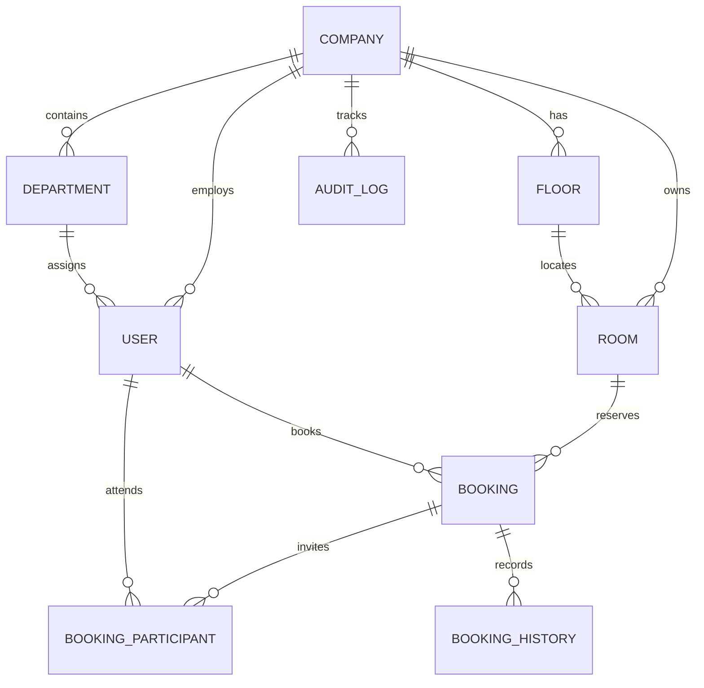
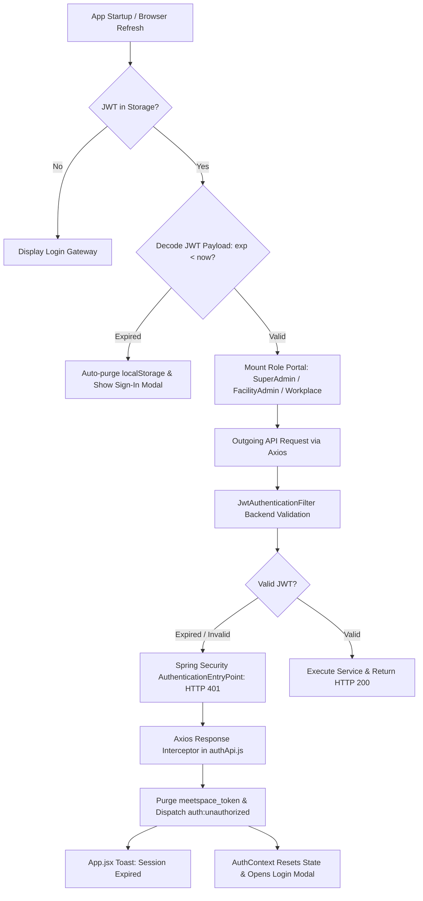

# Corporate Room Booking System — Project Requirements & Architecture

## 1. Project Overview

The Corporate Room Booking System (**MeetSpace / RoomBook**) is a multi-company, multi-tenant enterprise web application for managing companies, departments, floors, meeting rooms, room availability, bookings, attendees/participants, notifications, policies, and audit history.

The system is implemented as a **modular monolith** with Spring Boot powering the authoritative backend and React (Vite) providing role-based enterprise portals, unified in a single repository with production-ready packaging.

### Technology Stack

- **Backend**: Java 21, Spring Boot 3.3.4
- **Concurrency & High Throughput**: Java 21 Project Loom **Virtual Threads** enabled (`spring.threads.virtual.enabled=true`) for Tomcat request processing and asynchronous task dispatching
- **Security**: Spring Security 6 + JJWT (0.12.6) Stateless Token Authentication
- **Database**: H2 Persistent Disk Database (`jdbc:h2:file:D:/booking-db/roombookdb;AUTO_SERVER=TRUE`) with HikariCP High-Throughput Connection Pooling (portable to MySQL / PostgreSQL)
- **Database Migrations**: Flyway (Migrations V1 through V10)
- **Frontend**: React 18 + Vite (Tailwind/CSS corporate design tokens, Lucide React icons)
- **Build & Packaging**: Maven (`frontend-maven-plugin` integrates Vite build directly into Spring Boot static resources for single-JAR deployment)
- **Notifications**: Spring Event-Driven architecture (`ApplicationEventPublisher`) with `DummyEmailService` (supports pluggable SMTP/SendGrid providers)
- **AI Readiness**: Architecture contains deterministic business services decoupled from controllers, ready for Spring AI integration in future phases.

---

## 2. User Roles & Privileges

```text
+---------------------------------------------------------------------------------------+
|                                    PLATFORM ROLES                                     |
+-------------------+-----------------------------------+-------------------------------+
| SUPER_ADMIN       | COMPANY_ADMIN (Facility Admin)    | EMPLOYEE                      |
+-------------------+-----------------------------------+-------------------------------+
| • Company CRUD    | • Floor & Room Management         | • Real-time Room Search       |
| • Admin Creation  | • Department CRUD                 | • Instant & Future Booking    |
| • Platform Audit  | • Employee Directory Management   | • Participant Selection       |
| • Global Metrics  | • Booking Oversight & Bulk Ops    | • Smart Conflict Alternatives |
|                   | • Daily Occupancy Timeline        | • My Bookings Management      |
+-------------------+-----------------------------------+-------------------------------+
```

### 2.1 Super Admin (`ROLE_SUPER_ADMIN`)
Platform-level administrator overseeing the entire SaaS instance.
- Create, view, update, activate/suspend companies.
- Provision and manage Facility Administrators (Company Admins) per company.
- Access complete enterprise audit logs with actor details and timestamp filtering.
- Default bootstrap credentials initialized automatically via `DataInitializer`:
  - Email: `superadmin@system.com`
  - Password: `password123`

### 2.2 Facility Admin / Company Admin (`ROLE_COMPANY_ADMIN`)
Tenant-level administrator belonging to a specific company.
- Manage physical infrastructure: Floors (order, wings, status) and Rooms (capacity, amenities, maintenance toggle).
- Manage organizational structure: Departments and Employee Directory.
- Operational oversight: View company-wide bookings, cancel/modify company reservations, view real-time daily room occupancy timeline.
- Execute bulk status changes (e.g. bulk set rooms under maintenance, bulk activate/deactivate employees).

### 2.3 Employee (`ROLE_EMPLOYEE`)
Standard corporate user belonging to a company and department.
- Check room availability across floors and capacities for any date/time slot.
- Book rooms for immediate or future dates with meeting title, agenda, and participants.
- Receive intelligent alternative slot suggestions (same room next opening, alternative rooms on same floor/company) when conflicts occur.
- Manage personal reservations (view upcoming, edit details/time, cancel bookings).

---

## 3. High-Level System Architecture

```text
                               +---------------------------------------+
                               |         React 18 + Vite Client        |
                               |    Port 3000 (Dev) / Static (Prod)    |
                               +-------------------+-------------------+
                                                   |
                                                   | HTTP / REST (JSON)
                                                   | Base: /book/api
                                                   v
+------------------------------------------------------------------------------------------------------+
|                                Spring Boot 3 Modular Monolith (Port 8080)                            |
|                                         Context Path: /book                                          |
|                                                                                                      |
|  +------------------------------------------------------------------------------------------------+  |
|  | Security & Filter Chain: JwtAuthenticationFilter -> Spring Security 6 Authorization            |  |
|  | 401 Unauthorized EntryPoint (Expired/Missing Token) | 403 Forbidden AccessDeniedHandler        |  |
|  +------------------------------------------------------------------------------------------------+  |
|                                                   |                                                  |
|  +------------------------------------------------+-----------------------------------------------+  |
|  | API Controllers:                                                                               |  |
|  | • /api/auth/**                 -> AuthController (Login & JWT issuance)                        |  |
|  | • /api/admin/**                -> AdminController, AuditLogController (Super Admin)            |  |
|  | • /api/company/**              -> CompanyController (Tenant info)                              |  |
|  | • /api/facility/rooms/**       -> FacilityRoomController                                       |  |
|  | • /api/facility/floors/**      -> FacilityFloorController                                      |  |
|  | • /api/facility/departments/** -> FacilityDepartmentController                                 |  |
|  | • /api/facility/employees/**   -> FacilityEmployeeController                                   |  |
|  | • /api/facility/bookings/**    -> FacilityBookingController (Reserve, Occupancy, My-Bookings)  |  |
|  | • /api/facility/directory/**   -> FacilityDirectoryController (Summary metrics & directory)   |  |
|  +------------------------------------------------+-----------------------------------------------+  |
|                                                   |                                                  |
|  +------------------------------------------------+-----------------------------------------------+  |
|  | Business Services & Event Bus:                                                                 |  |
|  | • FacilityBookingService (Strict Concurrency & Overlap Prevention)                              |  |
|  | • Spring ApplicationEventPublisher -> BookingCreatedEvent / Updated / Cancelled                |  |
|  | • BookingNotificationListener -> DummyEmailService (Decoupled Background Dispatch)             |  |
|  | • AuditLogService (Actor, Entity, Old Value, New Value, Company Context)                       |  |
|  +------------------------------------------------+-----------------------------------------------+  |
|                                                   |                                                  |
|  +------------------------------------------------+-----------------------------------------------+  |
|  | Data Layer & Repositories:                                                                      |  |
|  | Spring Data JPA / Hibernate Batching | HikariCP Connection Pool (Max: 20, Idle: 5)              |  |
|  | Flyway Database Migrations (V1 .. V10)                                                          |  |
|  +------------------------------------------------+-----------------------------------------------+  |
+---------------------------------------------------+--------------------------------------------------+
                                                    |
                                                    v
                               +---------------------------------------+
                               |     Persistent H2 File Database       |
                               |    D:/booking-db/roombookdb.mv.db     |
                               |    H2 Console: /book/h2-console       |
                               +---------------------------------------+
```

---

## 4. Database Schema & Flyway Migration Evolution

The persistent schema is governed by automated Flyway versioned migrations:

| Version | Migration Script | Description |
| :--- | :--- | :--- |
| **V1** | `V1__initial_schema.sql` | Core schema: `companies`, `departments`, `users`, `rooms`, `booking_policies`, `bookings`, `booking_history`, `audit_logs`. |
| **V2** | `V2__add_performance_indexes.sql` | Composite indexes on `bookings(room_id, start_time, end_time, status)` for zero-latency overlap checks. |
| **V3** | `V3__optimize_facility_admin_search.sql` | Performance indexes for admin search queries and role filters. |
| **V4** | `V4__add_audit_logs_indexes.sql` | Indexes on `audit_logs(company_id, timestamp)` for high-speed audit log retrieval. |
| **V5** | `V5__add_phone_to_companies.sql` | Company contact enrichment with phone number support. |
| **V6** | `V6__add_comprehensive_performance_indexes.sql` | Composite indexes across user departments, room statuses, and booking dates. |
| **V7** | `V7__remove_default_seed_data.sql` | Cleanup of static seed fixtures in favor of dynamic runtime data initialization. |
| **V8** | `V8__create_floors_table.sql` | Introduces first-class `floors` entity (`company_id`, `floor_number`, `name`, `status`, `sort_order`). |
| **V9** | `V9__add_attendees_and_department_to_bookings.sql` | Adds attendee count and department attribution directly to bookings table. |
| **V10** | `V10__add_participants_support.sql` | Introduces `booking_participants` junction table linking bookings to company user records. |

### Core Database Entities



---

## 5. Security & Session Expiration Architecture

### 5.1 Authentication Flow
1. Client sends `POST /book/api/auth/login` with email and password.
2. `AuthService` verifies credentials via `AuthenticationManager` and `BCryptPasswordEncoder`.
3. `JwtProvider` generates a signed HMAC-SHA token containing `userId`, `email`, `companyId`, and `role`.
4. Response returns user details and the Bearer token (`app.jwt.expiration-ms=86400000` = 24 hours).

### 5.2 Four-Layer Session Expiration Safeguard

To guarantee that expired tokens never create silent failures or 403 console loops:



1. **Passive Client Startup Check** ([`AuthContext.jsx`](file:///e:/Booking/room-book/frontend/src/context/AuthContext.jsx)):
   - Inspects the JWT's `exp` claim before restoring state. If expired, it wipes `meetspace_token` and `meetspace_user` immediately, preventing "zombie" logged-in sessions.
2. **Active Axios Response Interceptor** ([`authApi.js`](file:///e:/Booking/room-book/frontend/src/api/authApi.js)):
   - Intercepts any HTTP 401 or 403 on authenticated requests, clears stored credentials, and dispatches a browser `auth:unauthorized` event.
3. **Reactive UI State Reset & Toast** ([`App.jsx`](file:///e:/Booking/room-book/frontend/src/App.jsx)):
   - Listens to `auth:unauthorized`, resets React auth context, pops open the login modal, and triggers a toast: *"Session Expired: Your session has expired. Please sign in again."*
4. **Backend Standards Compliance** ([`SecurityConfig.java`](file:///e:/Booking/room-book/src/main/java/com/javatechgroup/booking/security/SecurityConfig.java)):
   - Custom `AuthenticationEntryPoint` returns HTTP **401 Unauthorized** with structured JSON when the token is missing, corrupted, or expired.
   - `AccessDeniedHandler` returns HTTP **403 Forbidden** specifically when an authenticated user lacks the required role.

---

## 6. Booking Engine & Conflict Prevention

### 6.1 Availability Algorithm
A room is marked occupied for a requested range `[reqStart, reqEnd]` if any active booking exists where:

$$\text{existing.startTime} < \text{reqEnd} \quad \text{AND} \quad \text{existing.endTime} > \text{reqStart} \quad \text{AND} \quad \text{existing.status} = \text{'CONFIRMED'}$$

### 6.2 Guaranteed Double-Booking Prevention
1. **Database Level**: Multi-column composite index `idx_booking_room_time (room_id, start_time, end_time, status)`.
2. **Transaction Level**: Strict Spring `@Transactional(isolation = Isolation.READ_COMMITTED)` in `FacilityBookingService` with atomic verification before insert.
3. **Status Guards**: Soft cancellation (`status = 'CANCELLED'`) retains audit trail without releasing slots to past queries.

### 6.3 Smart Slot & Room Recommendations
When a collision is detected, `FacilityBookingService` automatically calculates alternatives:
1. **Same Room Next Opening**: Computes the earliest available opening of identical duration immediately following the blocking reservation.
2. **Alternative Rooms Same Slot**: Searches for other active rooms on the same floor or within the company matching the capacity requirements at the exact requested time.

### 6.4 High-Throughput Concurrency with Project Loom Virtual Threads
Spring Boot 3.3 runs on Java 21 with Project Loom Virtual Threads enabled via `spring.threads.virtual.enabled=true`:
- **Lightweight Thread-per-Request**: The embedded Tomcat servlet container uses `TomcatProtocolHandlerVirtualThreadExecutor`. Every incoming HTTP request executes on its own lightweight virtual thread instead of blocking an expensive platform OS thread.
- **Non-blocking Carrier Unmounting**: Whenever a thread executes blocking operations (e.g. HikariCP database query execution, disk I/O, or notification dispatch delay), the virtual thread unmounts from its carrier OS thread, allowing carrier threads to process thousands of other concurrent requests.
- **Asynchronous Task Execution**: Spring `@Async` task executors and scheduled jobs automatically leverage virtual thread pools without requiring manual executor tuning or risk of thread exhaustion.

---

## 7. Frontend Architecture & Portals

The frontend uses a single-page architecture switching between specialized portals based on user role:

```text
frontend/src/
├── api/
│   ├── authApi.js              # Axios base client, JWT interceptor, 401/403 auto-logout
│   ├── facilityApi.js          # Rooms, floors, departments, employees, bookings, directory
│   └── superAdminApi.js        # Company CRUD, admin provisioning, platform audit logs
├── components/
│   ├── SuperAdminPortal/       # Super Admin dashboard (Companies, Admins, Logs)
│   ├── FacilityAdminPortal/    # Facility operations (Rooms, Floors, Depts, Emps, Occupancy)
│   ├── WorkplacePortal/        # Employee workspace (Interactive Booking, Smart Slots)
│   ├── Header/                 # Navigation, active session info, theme toggle, sign out
│   ├── LoginGateway/           # Corporate hero sign-in screen
│   ├── LoginModal/             # Re-usable modal authentication dialog
│   └── common/
│       ├── ParticipantPicker/  # Searchable multi-employee attendee picker
│       ├── Toast/              # Global notification toast container
│       ├── Modal/              # Accessible modal dialogs
│       └── Select/             # Styled custom dropdowns
├── context/
│   ├── AuthContext.jsx         # Session state, JWT exp verification, auth:unauthorized listener
│   ├── ToastContext.jsx        # Unified toast notification engine
│   └── ConfirmContext.jsx      # Confirmation modals for destructive actions
└── App.jsx                     # Root role-based portal switcher and session event coordinator
```

---

## 8. REST API Reference

### 8.1 Authentication
| Method | Endpoint | Access | Description |
| :--- | :--- | :--- | :--- |
| `POST` | `/book/api/auth/login` | Public | Authenticates user; returns JWT Bearer token and user info |

### 8.2 Super Administrator (`/book/api/admin/**`)
| Method | Endpoint | Access | Description |
| :--- | :--- | :--- | :--- |
| `GET` | `/book/api/admin/companies` | `SUPER_ADMIN` | Paginated company listing with search and status filter |
| `POST` | `/book/api/admin/companies` | `SUPER_ADMIN` | Create new enterprise company tenant |
| `PUT` | `/book/api/admin/companies/{id}` | `SUPER_ADMIN` | Update company metadata and contact details |
| `PATCH` | `/book/api/admin/companies/{id}/status` | `SUPER_ADMIN` | Toggle company active/suspended status |
| `GET` | `/book/api/admin/facility-admins` | `SUPER_ADMIN` | List all provisioned company facility administrators |
| `POST` | `/book/api/admin/facility-admins` | `SUPER_ADMIN` | Provision a new Facility Admin for a company |
| `PUT` | `/book/api/admin/facility-admins/{id}` | `SUPER_ADMIN` | Update administrator account details |
| `PATCH` | `/book/api/admin/facility-admins/{id}/status` | `SUPER_ADMIN` | Activate or suspend administrator account |
| `GET` | `/book/api/admin/audit-logs` | `SUPER_ADMIN` | Retrieve system-wide paginated audit activity logs |

### 8.3 Facility & Operations (`/book/api/facility/**`)
| Method | Endpoint | Access | Description |
| :--- | :--- | :--- | :--- |
| `GET` | `/book/api/facility/rooms` | All Roles | Paginated room search filtered by floor, capacity, status |
| `POST` | `/book/api/facility/rooms` | `COMPANY_ADMIN`, `SUPER_ADMIN` | Create meeting room |
| `PUT` | `/book/api/facility/rooms/{id}` | `COMPANY_ADMIN`, `SUPER_ADMIN` | Update room amenities, capacity, and details |
| `PATCH` | `/book/api/facility/rooms/{id}/maintenance` | `COMPANY_ADMIN`, `SUPER_ADMIN` | Toggle room maintenance mode |
| `PATCH` | `/book/api/facility/rooms/bulk/status` | `COMPANY_ADMIN`, `SUPER_ADMIN` | Bulk update room status (`AVAILABLE` / `MAINTENANCE`) |
| `GET` | `/book/api/facility/floors/all` | All Roles | Retrieve all configured company floors |
| `POST` | `/book/api/facility/floors` | `COMPANY_ADMIN`, `SUPER_ADMIN` | Create floor record |
| `PUT` | `/book/api/facility/floors/{id}` | `COMPANY_ADMIN`, `SUPER_ADMIN` | Update floor details and ordering |
| `GET` | `/book/api/facility/departments` | All Roles | Paginated departments listing |
| `POST` | `/book/api/facility/departments` | `COMPANY_ADMIN`, `SUPER_ADMIN` | Create company department |
| `GET` | `/book/api/facility/employees` | `COMPANY_ADMIN`, `SUPER_ADMIN` | Search employee directory with department/role filters |
| `POST` | `/book/api/facility/employees` | `COMPANY_ADMIN`, `SUPER_ADMIN` | Register new employee |
| `PUT` | `/book/api/facility/employees/{id}` | `COMPANY_ADMIN`, `SUPER_ADMIN` | Update employee information |
| `POST` | `/book/api/facility/bookings` | All Roles | Create booking with conflict checking & attendee invites |
| `PUT` | `/book/api/facility/bookings/{id}` | All Roles | Update scheduled booking |
| `POST` | `/book/api/facility/bookings/{id}/cancel` | All Roles | Cancel booking (owner or admin) |
| `GET` | `/book/api/facility/bookings/my-bookings` | All Roles | Retrieve personal bookings for logged-in user |
| `GET` | `/book/api/facility/bookings/occupancy` | All Roles | Get full timeline of room occupancy for a specific date |
| `GET` | `/book/api/facility/directory/summary` | All Roles | High-level metrics (rooms, depts, employees, bookings) |

---

## 9. Development & Deployment Model

```text
DEVELOPMENT MODE:
+------------------------------------+          +------------------------------------+
|  Vite Dev Server (Port 3000)       |          |  Spring Boot Backend (Port 8080)   |
|  Base: /book/                      |          |  Context: /book                    |
|  Proxy: /book/api -> :8080         | -------> |  H2 Database: D:/booking-db/       |
|         /book/h2-console -> :8080  |          |  H2 Console: /book/h2-console      |
+------------------------------------+          +------------------------------------+

PRODUCTION PACKAGING (Single Executable JAR):
+------------------------------------------------------------------------------------+
|  1. frontend-maven-plugin runs `npm run build` -> compiles Vite app to /dist       |
|  2. maven-resources-plugin copies /dist contents into target/classes/static        |
|  3. spring-boot-maven-plugin packages unified room-book-0.0.1.jar                  |
|  4. Run `java -jar room-book-0.0.1.jar` -> Serves frontend & API on :8080/book/   |
+------------------------------------------------------------------------------------+
```

---

## 10. Verification & Audit Checklist

- [x] **Multi-Tenant Security**: Tenant boundaries strictly enforced using `company_id` resolved from authenticated `UserPrincipal`.
- [x] **Concurrency Safety**: Double booking prevented via strict database composite indexes and transactional checks.
- [x] **Graceful Expiration**: Frontend intercepts 401/403, purges dead tokens, and alerts the user with automatic login modal display.
- [x] **Audit Trails**: Critical operations (company creation, room updates, employee edits, cancellations) logged into `audit_logs`.
- [x] **Decoupled Notifications**: Email notifications dispatched via Spring Application Events without blocking HTTP request threads.
- [x] **Virtual Threads Concurrency**: Project Loom enabled for Tomcat request handling and Spring task execution with zero thread pool bottlenecks.
- [x] **Modular Build**: Monolith builds cleanly with zero compilation errors (`BUILD SUCCESS`).
